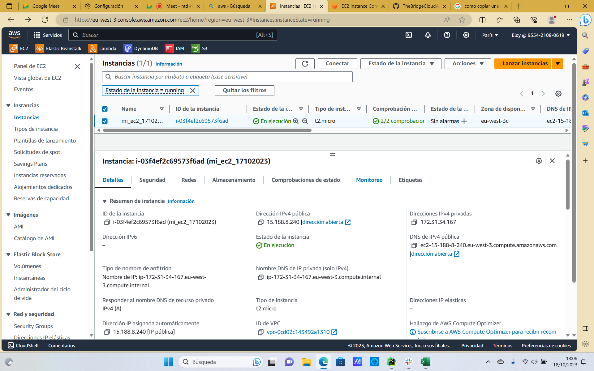

# Desarrollo de Ejercicios de AWS

En este conjunto de ejercicios, exploraremos la implementación de soluciones en Amazon Web Services (AWS) para satisfacer los requisitos de una empresa que trabaja con datos y busca automatizar procesos relacionados con el almacenamiento, procesamiento y visualización de información de usuarios.

## Índice

1. [Ejercicio 1: Automatización de Datos](#ejercicio-1)
2. [Ejercicio 2: Creación de una Aplicación Web](#ejercicio-2)
3. [Ejercicio 3: Integración de Formulario Web](#ejercicio-3)
4. [EXTRA - Automatizar proceso con CLI](#proceso-cli)

## Ejercicio 1: Automatización de Datos
Este primer ejercicio se enfoca en automatizar la transferencia de datos desde un bucket de almacenamiento de Amazon S3 a una base de datos en Amazon DynamoDB. La empresa recibe archivos JSON con información de usuarios y desea procesarlos de manera eficiente. En este ejercicio, abordaremos la creación de roles, configuración de S3, creación de una tabla DynamoDB y desarrollo de una función Lambda que se activará cuando se cargue un archivo JSON en S3.

## Ejercicio 2: Creación de una Aplicación Web
El segundo ejercicio trata sobre la creación de una aplicación web para visualizar la base de datos de usuarios almacenada en DynamoDB. La empresa necesita una interfaz que les permita acceder y gestionar esta información de manera sencilla. En este ejercicio, abordaremos la creación de una instancia EC2, el desarrollo de una aplicación web utilizando la biblioteca Dash en Python y la implementación de un menú de navegación que permita acceder a un formulario de usuarios y una tabla de usuarios.

## Ejercicio 3: Integración de Formulario Web
El tercer ejercicio, más avanzado, implica la creación de un formulario web para la entrada de datos de usuarios que se almacenan en S3 y se integran con los procesos del Ejercicio 1. La empresa busca automatizar el proceso de carga de datos a través de un formulario en línea. En este ejercicio, abordaremos la creación de una aplicación web que incluye un formulario de ingreso de datos y la capacidad de almacenar automáticamente los datos ingresados en S3, lo que activará la función Lambda del Ejercicio 1 y actualizará la tabla de usuarios en la aplicación web del Ejercicio 2.

Siga los enlaces para acceder a cada uno de los ejercicios y obtener detalles completos sobre su implementación.


># Ejercicio 1
>Este desarrollo es para una empresa que trabaja con datos y tiene la necesidad de que cada vez que se crea un fichero Json 
en un bucket de almacenamiento de S3, se lance una función que guarde el contenido de ese fichero en una base de datos montada en DynamoDB.
>La estructura del Json que reciben es la siguiente:
>````json
>{
>    "ID": 123456,
>    "Nombre": "Juan Pérez",
>    "Correo electrónico": "juan.perez@example.com",
>    "Fecha de registro": "2022-01-01T10:00:00Z"
>}
>````
>La empresa trabaja de manera agile intentando ir al mínimo viable por lo que su primer objetivo es crear una base de datos en
diamoDB, luego crear una función que reciba a mano un json y por último que ese json lo lea desde un almacenamiento S3. 


# Indice
***
1. [Creacion de Roles](#creacion-de-roles)
2. [Creacion de un S3](#creacion-de-un-s3)
3. [Creacion de una DynamoDB](#creacion-de-una-dynamodb)
4. [Creacion de Lambda](#creacion-de-lambda)


## Creacion de Role
***

Para que los distintos servicios interactuen entre ellos, antes hay que crear los roles que les permitan tener acceso a los mismos. Vamos a crear el rol para la Lambda.

En AWS buscamos IAM y seguidamente pulsariamos en **roles**.
Crearemos un rol nuevo.En la primera pestaña,en **Use case** seleccionamos el servicio Lambda.


Seguidamenet en la siguiente pestaña, pondremos nombre que elijamos en el campo **Role name**. Luego elejiremos los siguientes permisos.


Y dariamos a **Create Role**.

Con esto ya tendriamos creado el rol que vamos a usar.


## Creacion de un S3
***

En este punto crearemos el almacenamiento donde se guardaran los json con los datos de los usuarios.
Buscaremos S3 y seguidamente pulsaremos en **Create a bucket**.
En al siguiente ventana le pondremos un nombre que tiene que ser unico, el resto de opciones las dejaremos como vienen por defecto.


## Creacion de una DynamoDB
***

Aqui crearemos una BBDD NoSQL, nos iremos al buscador y la buscaremos.
Pulsaremos en **Create Table**. Le podremos el nombre que elijamos y la opcion *Partition key* pondremos ID, ya que sera el valor unico que tendra cada registro que iremos añadiendo.
Lo pondremos de tipo *Number*.


## Creacion de Lambda
***

Con todos los serivicios anteriores creados, crearemos una funcion para que interactue con los mismos.
Buscaremos lambda y le daremos a **Create function**.
En *Function name* le pondremos el nombre que elijamos, en *Runetime* elejiremos Python 3.11 y en *Execution role* elejiremos el rol que hemos creado antes.


Una vez creada con los parametros antes indicados, entramos en ella y nos situamos en la pestaña **Code**
Aqui introduciremos los siguientes comandos de python.

```python
import json
import boto3

# Creando una instancia de la tabla DynamoD y s3
s3 = boto3.client('s3')
dynamodb = boto3.resource('dynamodb')

# Nombre de la tabla en DynamoDB
table = dynamodb.Table('mi-ejercicio-aws')

def lambda_handler(event, context):
    # TODO implement
    print(event)
    # Obtiene el nombre del bucket y la clave del archivo JSON del evento de S3
    bucket = event['Records'][0]['s3']['bucket']['name']
    key = event['Records'][0]['s3']['object']['key']
    print(bucket)
    print(key)
    
    # Descarga el archivo JSON desde S3
    response = s3.get_object(Bucket=bucket, Key=key)
    json_data = response['Body'].read().decode('utf-8')

    # Parsea el JSON
    data = json.loads(json_data)

    # Inserta los datos en DynamoDB utilizando el recurso
    response = table.put_item(
        Item={
            'ID': data['ID'],
            'Nombre': data['Nombre'],
            'Correo electrónico': data['Correo electrónico'],
            'Fecha de registro': data['Fecha de registro']
        }
        
    )
    return 
```
Con esto conseguiremos que la lambda recoja los datos introducidos en el S3 y los vuelque en la dynamoDB


> # Ejercicio 2 
>El siguiente requerimiento de la empresa es que una vez que tenga una base solida de usuarios en dynamoDB, quieren 
realizar una página web que muestre toda su base de datos de usuario de esta manera puedan tener un inventario sólido, 
como primeros pasos les sirve realizar la ejecución de la web en local, si ven que es viable se plantean ejecutarlo con EC2.
Como no tienen mucho conocimiento en programación web, el cliente ha concedido a la consultora usar ChatGPT.

# Índice 
***
- [Creación de EC2](#creación-de-ec2)
- [Web DataBase](#web-database)


## Creación de EC2
***

1.1.- Lanzar la instancia: Este es el primer paso para crear una instancia EC2.

1.2.- Seleccionar una AMI, básicamente es un modelo de sistema operativo.

1.3.- Seleccionar el tipo de instancia que se adapta a nuestras necesidades. Las opciones varian en terminos de capacidad y memoria.

1.4.- Detalles de la instancia, número de instancias, opciones de red, y ajustes de almacenamiento.

1.5.- Reglas de seguridad para tus instancia, determinando que tipo de tráfico esta permitido hacia y desde tu instancia.

1.6.- Elegir una clave, esto te permitira acceder de manera segura a tu instancia.

1.7.- Una vez la instancia esta en ejecución, tal y como se muestra en la imagen, puedes acceder a ella mediante SSH.

  

 
## Web DataBase
**1.-Importar las bibliotecas:**

   import boto3: Esta línea importa la biblioteca Boto3, que es una biblioteca de Python utilizada para interactuar 
   con servicios de Amazon Web Services (AWS), como DynamoDB.

   import dash: Importa la biblioteca Dash, que es una biblioteca de Python para crear aplicaciones web interactivas.

**2.-Configuración de la región y conexión a DynamoDB:**

  region="eu-west-3": Define la región de AWS en la que se encuentra la tabla DynamoDB.

  dynamodb = boto3.resource('dynamodb', region_name=region): Crea una instancia de la clase DynamoDB en la región especificada.

  tabla_usuarios = dynamodb.Table('miEjercicioFinalAWS'): Conecta a la tabla llamada 'miEjercicioFinalAWS' en DynamoDB.

**3.-Escaneo de la tabla y obtención de datos:**

   response = tabla_usuarios.scan(): Realiza una operación de escaneo en la tabla de usuarios y guarda la respuesta en la variable response.
   
   items = response['Items']: Extrae los elementos escaneados de la respuesta y los almacena en la variable items.
   
**4.-Creación de la aplicación web Dash:**

   app = dash.Dash(__name__): Crea una instancia de la aplicación web Dash con el nombre "name".

**5.-Diseño de la interfaz de la aplicación:**

  app.layout = html.Div(...): Define la interfaz de la aplicación web, que consiste en un título "Tabla de usuarios" y una tabla generada dinámicamente a partir de los datos en items.

**6.-Ejecución de la aplicación web:**

   if __name__ == '__main__':: Comprueba si el script se está ejecutando directamente.

   app.run_server(host='0.0.0.0', port=8080, debug=True): Inicia el servidor web de la aplicación en el puerto 8080 y permite la depuración (debug). Esto significa que cuando ejecutes el script, la aplicación estará disponible en tu servidor local en la dirección 'http://0.0.0.0:8080/'.

```python

import boto3
import dash
from dash import html


region="eu-west-3"
dynamodb = boto3.resource('dynamodb', region_name=region)
tabla_usuarios = dynamodb.Table('miEjercicioFinalAWS')


response = tabla_usuarios.scan()
items = response['Items']


app = dash.Dash(__name__)


app.layout = html.Div(children=[
    html.H1(children='Tabla de usuarios'),

    
    dash.dash_table.DataTable(items)
])

if __name__ == '__main__':

    app.run_server(host='0.0.0.0', port=8080, debug = True)
    
```


### 3. Levantar aplicación.
***


3.1.- Accedemos a nuestra terminal de EC2

3.2.- Levantamos la aplicacion python3 app.py

3.3.- Copiamos la IP Pública y la pegamos en el navegador http://direccionIPPublica:8080 "puerto de salida en este caso"

3.4.- La web con el DataBase debería estar correctamente levantado.


># Ejercicio 3
>Una vez que tengan realizados los ejercicios anteriores, se plantean la realización de un formulario web para no tener que 
rellenar a mano los json de usuarios y guardarlos en S3. Para ello se plantean crear una aplicación web en el lenguaje que decida 
el proveedor que levante un formulario y que al guardar genere un fichero json en S3. 
Cuando se genere este fichero, al crearse en S3 se disparará automáticamente la función que dispare el primer requerimiento 
y a su vez quedará actualizado en la app de seguimiento de usuarios. 

# Índice 
***
- [Formulario](#formulario.py)
  - [Ajustes/debugs](#ajustes/debugs)
- [Web formulario y Database](#web-formulario-y-database)
  - [Ajustes/debugs](#ajustes/debugs)
## Formulario.py
***

Hemos utilizado el archivo `app_save_formulario.py`, proporcionado por el profesor, para crear una aplicación en nuestra instancia de EC2. Realizamos las adaptaciones necesarias para que funcione con nuestro bucket y región. Además, configuramos el `run_server` para ejecutarse en la web (`host='0.0.0.0', port=8080`). 

### Ajustes/debugs
***

- Cambiamos las funciones `Input` de los campos de "nombre" y "email" a `State`. Esto se debe a que `Input` se utiliza para especificar cuál es el componente y el evento que debe activar la función del callback. Con la configuración anterior, cada interacción del usuario, incluyendo la inserción de cada carácter, activaba el callback y subía el archivo. La modificación se ve de la siguiente manera:

    ```python
    # Ruta para manejar la subida de datos del formulario
    @app.callback(
        dash.dependencies.Output('output-container-button', 'children'),
        [dash.Input('submit-button', 'n_clicks'),
        dash.State('nombre', 'value'),
        dash.State('email', 'value')])
    ```


- Especificamos el parámetro region_name al crear la instancia de S3. Esto se debe a que S3 está restringido a la región de origen. La modificación se ve de la siguiente manera:

    ```python
    # Creamos un cliente de boto3 para acceder a S3
    s3 = boto3.client('s3',region_name="eu-west-3")
    ```

    
- Modificamos los permisos del rol de EC2 para permitir la escritura en S3 utilizando putObject.


Con esos ajustes el formulario nos funcino perfectamente:


 


## Web formulario y Database
***

Luego, consideramos la opción de combinar el formulario y la tabla en una sola página web con un menú de navegación. Con la ayuda del chat para crear el diseño de la aplicación, los enlaces y los callbacks, mejoramos el siguiente script de la página:

### Ajustes/debugs
***

- Habilitamos suppress_callback_exceptions al crear la aplicación Dash para evitar interferencias entre los callbacks y las salidas. Esta modificación se ve de 
    > ```
    > app = dash.Dash(__name__, suppress_callback_exceptions=True)
    > ```


- Agregamos una condición para ejecutar s3.object solo después de hacer clic en el botón "Enviar", lo que evita la subida de archivos vacíos. La modificación se ve de la siguiente manera:
    > ```python
    >def submit_form(n_clicks, nombre, email):
    >    if n_clicks > 0:  # Verifica si se hizo clic en el botón "Enviar"
    >        # Obtenemos los datos del formulario
    >        usuario = {
    >            'ID': random.randint(100000, 999999),
    >            'Nombre': nombre,
    >            'Correo electrónico': email,
    >            'Fecha de registro': today
    >        }
    >        # Guarda los datos en un archivo JSON en S3
    >        s3.put_object(Bucket='misjsonocanha', Key=f'usuarios{today}.json', Body=json.dumps(usuario))
    >        return f'Datos guardados en S3: {usuario}'  # Puede ser útil proporcionar una confirmación
    >    else:
    >        return 'Aún no se ha hecho clic en el botón "Enviar"'
    > ```

### Pagina del formulario de la app
 


### Pagina de la tabla de la app
 


Proporciono codigo completo:

> ```python
    > import json
    > import boto3
    > import dash
    > from dash import dcc
    > from dash import html
    > from dash import dash_table
    > import random
    > import datetime
    >
    > # Creamos una aplicación Flask
    > app = dash.Dash(__name__, suppress_callback_exceptions=True)
    >
    > # Creamos un cliente de boto3 para acceder a S3
    > s3 = boto3.client('s3', region_name="eu-west-3")
    > today = datetime.date.today().strftime('%Y-%m-d')
    >
    > # Configuramos la conexión a la tabla de DynamoDB
    > dynamodb = boto3.resource('dynamodb', region_name='eu-west-3')
    > tabla_usuarios = dynamodb.Table('ejercicios_general1')
    >
    > # Función para obtener los datos de la tabla de DynamoDB
    > def obtener_datos_dynamodb():
    >     response = tabla_usuarios.scan()
    >     items = response['Items']
    >     return items
    >
    > # Definimos el diseño general de la aplicación
    > app.layout = html.Div([
    >     html.H1('Menú de Navegación'),  # Título de la página
    >
    >     # Menú de navegación
    >     dcc.Link('Formulario de Usuarios', href='/formulario'),  # Enlace al formulario
    >     html.Br(),  # Salto de línea
    >     dcc.Link('Tabla de Usuarios', href='/tabla_usuarios'),  # Enlace a la tabla de usuarios
    >     html.Br(),  # Salto de línea
    >
    >     # Aquí se mostrará el contenido de las páginas
    >     dcc.Location(id='url', refresh=False),
    >     html.Div(id='page-content')
    > ])
    >
    > # Callback para cargar el contenido de las páginas
    > @app.callback(
    >     dash.dependencies.Output('page-content', 'children'),
    >     [dash.Input('url', 'pathname')]
    > )
    > def display_page(pathname):
    >     if pathname == '/formulario':
    >         # Si el usuario navega al formulario, muestra el contenido del formulario
    >         return html.Div([
    >             html.H1('Formulario de Usuarios'),
    >             dcc.Input(id='nombre', type='text', placeholder='Nombre', value=''),
    >             dcc.Input(id='email', type='email', placeholder='Email', value=''),
    >             html.Button('Enviar', id='submit-button', n_clicks=0),
    >             html.Div(id='output-container-button', children='Hit the button to update.')
    >         ])
    >     elif pathname == '/tabla_usuarios':
    >         # Si el usuario navega a la tabla de usuarios, muestra el contenido de la tabla
    >         data = obtener_datos_dynamodb()
    >         return html.Div([
    >             html.H1('Tabla de Usuarios'),
    >             dash_table.DataTable(
    >                 columns=[{'name': key, 'id': key} for key in data[0].keys()],
    >                 data=data
    >             )
    >         ])
    >
    > # Ruta para manejar la subida de datos del formulario
    > @app.callback(
    >     dash.dependencies.Output('output-container-button', 'children'),
    >     [dash.Input('submit-button', 'n_clicks'),
    >     dash.State('nombre', 'value'),
    >     dash.State('email', 'value')]
    > )
    >
    > def submit_form(n_clicks, nombre, email):
    >     if n_clicks > 0:  # Verifica si se hizo clic en el botón "Enviar"
    >         # Obtenemos los datos del formulario
    >         usuario = {
    >             'ID': random.randint(100000, 999999),
    >             'Nombre': nombre,
    >             'Correo electrónico': email,
    >             'Fecha de registro': today
    >         }
    >         # Guarda los datos en un archivo JSON en S3
    >         s3.put_object(Bucket='misjsonocanha', Key=f'usuarios{today}.json', Body=json.dumps(usuario))
    >         return f'Datos guardados en S3: {usuario}'  # Puede ser útil proporcionar una confirmación
    >     else:
    >         return 'Aún no se ha hecho clic en el botón "Enviar"'
    >
    > if __name__ == '__main__':
    >     app.run_server(host='0.0.0.0', port=8080, debug=True)
    > ```


# Proceso CLI
***
[Enlace para archivo](proyecto_aws_cli.ipynb)
